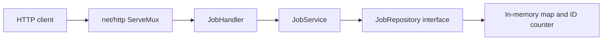

# Distributed Job / Workflow System

A Go learning project that accepts jobs over HTTP and stores them in memory. The current version creates and retrieves `send_email` and `classify_meeting` jobs. Jobs start as `queued`; workers, email delivery, and meeting classification are future work.

## Current architecture



`main.go` creates one repository, injects it into the service, injects the service into the handler, and registers the routes. `http.ListenAndServe(":8080", nil)` serves them through `http.DefaultServeMux`. Results travel back through the same layers to the HTTP response.

| Location | Responsibility |
| --- | --- |
| `main.go` | Dependency wiring, route registration, and server startup. |
| `controller/handler/job_handler.go` | Parse JSON and path parameters; choose HTTP status codes and encode responses. |
| `service/jobService.go` | Validate job types, payload fields, and IDs; set initial status; call the repository and wrap its errors. |
| `repository/repository_job.go` | Define the repository interface; assign IDs and store, retrieve, replace, or delete job values. |
| `model/model_job.go` | Shared `Job`, `EmailInput`, and `MeetingInput` structs. |
| `repository/*_test.go`, `service/*_test.go` | Tests for repository Save/Get and service job creation. |

For creation, the handler decodes `input` as `json.RawMessage`, selects its concrete payload type using `job_type`, and passes that value to the service. The service validates it and creates a queued job; the repository assigns an ID starting at 1.

For retrieval, the handler parses `{id}` into a positive `int64`; the service calls the repository's map lookup. Repository `Update` and `Delete` methods exist, but neither has an HTTP endpoint yet.

## Run locally

Use Go **1.27.1 or later**, as required by `go.mod`, and `curl` for the examples. No database, API keys, or external services are needed. Run these commands from the repository root:

```sh
go version
go test -count=1 ./...
go run .
```

The server prints `Listening on port 8080...`. Leave that terminal running and use another terminal for requests to `http://localhost:8080`. Stop it with **Ctrl+C**. Restarting clears all jobs and resets the ID counter.

The address is currently hardcoded as `:8080` in `main.go`, which listens on available network interfaces. There is no `PORT` environment-variable setting. Use sequential local requests while the repository has no concurrency protection.

## Try the API

| Method and path | Behavior | Success |
| --- | --- | --- |
| `POST /jobs` | Validate and store a job. | `201 Created` with the saved job. |
| `GET /jobs/{id}` | Retrieve a job by positive integer ID. | `200 OK` with the stored job. |

Create an email job:

```sh
curl -i http://localhost:8080/jobs \
  -H 'Content-Type: application/json' \
  -d '{"job_type":"send_email","input":{"Email":"learner@example.com","Message":"Hello from the job system"}}'
```

On a fresh server, the response has status `201` and this JSON body:

```json
{"ID":1,"Status":"queued","JobType":"send_email","Input":{"Email":"learner@example.com","Message":"Hello from the job system"}}
```

Retrieve it using the `ID` returned by POST:

```sh
curl -i http://localhost:8080/jobs/1
```

The response has status `200` and the same job body. To create a meeting job:

```sh
curl -i http://localhost:8080/jobs \
  -H 'Content-Type: application/json' \
  -d '{"job_type":"classify_meeting","input":{"MeetingID":"meeting-001","Summary":"Discuss the project roadmap."}}'
```

The request envelope uses `job_type` and `input`. Payload and response structs have no JSON tags, so these examples use their exported Go field names: `Email`, `Message`, `MeetingID`, `Summary`, and response fields `ID`, `Status`, `JobType`, `Input`. Use `MeetingID`, not `meeting_id`. Required payload fields must be nonempty strings; email addresses are not checked for valid address syntax.

Success bodies are JSON. Error bodies are plain text:

| Request or condition | Current response |
| --- | --- |
| Malformed JSON, unsupported job type, or invalid payload | `400 Bad Request` |
| `GET /jobs/abc`, `/jobs/0`, `/jobs/-1`, or an overflowing ID | `400 Bad Request`: `Invalid job ID` |
| `GET /jobs/999` when that ID is absent | `404 Not Found`: `Job not found` |
| `GET /jobs` or `PUT /jobs/1` | `405 Method Not Allowed` |
| Failure to marshal a response | `500 Internal Server Error` |

There is no job-list endpoint. Creation service errors currently become `400`; retrieval service errors become `404`, including any underlying repository errors. More precise error classification remains future work.

## Test and debug

Run all tests or narrow a failure to one layer:

```sh
go test -count=1 ./...
go test -v ./repository -run TestGetTableDriven
go test -v ./service -run TestCreateJob
```

There are no automated handler tests or service `GetJob` tests yet. The repository map and ID counter are unsynchronized. `go test -race ./...` can detect races exercised by tests, but the current sequential tests do not establish that concurrent HTTP access is safe.

For step-by-step debugging, install [Delve](https://github.com/go-delve/delve/blob/master/Documentation/installation/README.md) if needed:

```sh
go install github.com/go-delve/delve/cmd/dlv@latest
dlv version
```

If `dlv` is not found, add the Go binary installation directory to your shell's `PATH`: `go env GOBIN` if configured, otherwise the `bin` directory under `go env GOPATH`. On macOS, Delve also needs the Xcode command-line tools; see the installation guide for platform setup.

Stop any existing server on port 8080, then run from the repository root:

```sh
dlv debug .
```

At the `(dlv)` prompt, set a breakpoint and start the server:

```text
break job-system/service.(*JobService).GetJob
continue
```

In another terminal, create a job with the POST example and request its ID with the GET example. The GET request waits while the debugger is paused. Back at `(dlv)`, inspect the ID and call stack:

```text
print jobID
stack
next
locals
```

Use `next` to advance through validation and the repository call, or `step` to enter a call. Inspect `job` and `err` after the repository call has executed, then use `continue` to finish the request. A fresh debugger process has empty storage, so requesting ID 1 before creating it returns `404` after you continue. To finish debugging, press Ctrl+C if the program is running, then enter `quit`. See the [Delve command reference](https://github.com/go-delve/delve/blob/master/Documentation/cli/README.md) for more commands.

Useful places to follow a request are `JobHandler.CreateJob` → `JobService.CreateJob` → repository `Save`, or `JobHandler.GetJob` → `JobService.GetJob` → repository `Get`.

| Symptom | What to check |
| --- | --- |
| Connection refused | Start `go run .`, or enter `continue` in Delve so the server starts listening. |
| Address already in use | Stop the earlier server/debugger. On macOS/Linux, inspect the listener with `lsof -nP -iTCP:8080 -sTCP:LISTEN`. |
| A job returns `404` | Use the ID from POST in the same running process; restarts discard storage. |
| POST returns `400` | Check the job type, payload field names, and required fields; inspect service validation in the debugger for the detailed error. |
| Request waits during debugging | Check for a breakpoint hit and use `continue` to resume execution. |

## Remaining work

Add synchronization for concurrent requests, a DELETE endpoint, and focused retrieval/handler tests. Later milestones add a bounded worker pool, priority scheduling, retries, workflow dependencies, recovery, rate limiting, durable storage, and observability. The current server also has no configured timeouts or graceful shutdown.

Verified on September 18, 2026 with Go 1.27.1: an uncached test run passed; sequential HTTP checks covered email/meeting creation and retrieval plus malformed requests, invalid/missing IDs, and unsupported methods. A Delve session reached the service `GetJob` breakpoint and inspected the requested ID and call stack.
